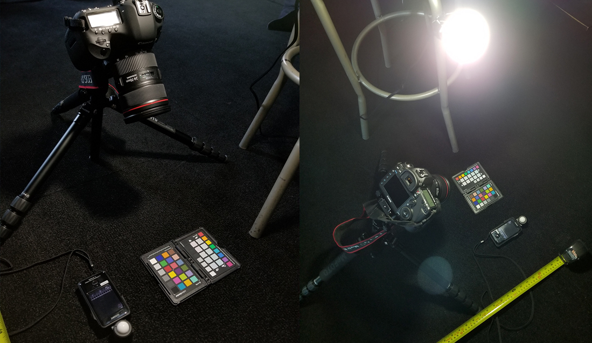

# Physical Cameras in Stingray (Part 1) #
This is a quick blog to share some of the progress we made lately with Physical Cameras in Stingray. Our goal of implementing a solid physically based pipeline has always been split in three phases. First we validated our standard material. We then added physical lights. And now we are wrapping it up with a physical camera.

We define a physical camera as an entity controlled by the same parameters a real world camera would use. These parameters are split into two groups which corresponds to the two main parts of a camera. The camera _body_ is defined by it's sensor size, iso sensitivity, and a range of available shutter speeds. The camera _lens_ is defined by it's focal length, focus range, and range of aperture diameters. Setting all of these parameters should expose the inconming light the same way a real world camera would.

### Stingray Representation ###
Just like our physical light, our camera is expressed as an entity with a bunch of components. The main two components being the Camera Body and the Camera Lens. All other component values are driven by these first two. The mapping of these values is done through a script component which also belongs to the camera entity. Here is a glimpse of what the Physical Camera entity may look like (wip):

So while there are a lot of components that belongs to a camera, the user is expected to interact only with the body and lens component. The value of all the other components are derived from these main two through the "Properties Mapper" script component. 

### Post Effects ###
A lot of our post effects are didicated to simulate some sort of camera/lens artifact (DOF, motion blur, film grain, vignetting, bloom, chromatic aberation, ect). One thing we wanted was the ability for physical cameras to override some of the post processes defined in our global shading environments. We also wanted to let users easily opt out of the physically based mapping that occured between a camera and it's corresponding post-effect. For example a physical camera will generate a accurate circle of confusion for the depth of field effect, but a user might be frustrated by the limitations imposed by a physically correct dof effect. In this case a user can optout by simply deleting the "Depth Of Field" component from the camera entity.

It's nice to see how the expressiveness of the Stingray entity system is shaping up and how it enables us to build these complex entities without the need to change much of the engine.

### Properties Mapper ###
All of the mapping occurs in the properties mapper component which is basically just a lua script that gets executed whenever any of the entity properties are edited.

The most important property we wanted to map was the exposure value. We wanted the f-stop, shutter speed, and ISO values to map to an exposure value which would simulate how a real camera sensor reacts to incoming light. Lucky for is, this is a topic that was very well covered by Sebastien Lagarde and Charles de Rousiers in their awesome awesome awesome [Moving Frostbite to Physically Based Rendering](https://seblagarde.files.wordpress.com/2015/07/course_notes_moving_frostbite_to_pbr_v32.pdf) document. The mapping basically boils down to:

~~~
local function compute_ev(aperture, shutter_time, iso)
	local ev_100 = log2((aperture * aperture * 100) / (shutter_time * iso))
	local max_luminance = 1.2 * math.pow(2, ev_100)
	return (1 / max_luminance)
end
~~~

The second property we were really keen on mapping is the field of view of the camera. Usually the horizontal FOV is calculated as _2 x atan(h/2f)_ where _h_ is the camera sensor's with and _f_ is the current focal length of the lens. This by itself gives a good approximation of the FOV of a lens, but as was pointed out by the [MGS5 & Fox Engine presentation](https://youtu.be/FQMbxzTUuSg?t=50m12s), the focus distance of the lens should also be considered when mapping calculating FOV from the camera properties.

Intuitively we though that the change in the FOV was caused by a change in the effective focal length of the lens. Adjusting the focus usually shifts a group of lens up and down the optical axis of a lens and our understanding/guess was that this shift increased and decreased the effective focal length of the lens. Using this idea we we're able to simulate the effect changing the focus point has on the FOV of a camera:

[https://www.youtube.com/watch?v=KDwUi-vYYMQ](https://www.youtube.com/watch?v=KDwUi-vYYMQ&feature=youtu.be)

~~~
local function compute_fov(focal_length, film_back_height, focus)
	local normalized_focus = (focus - 0.38)/(5.0 - 0.38)
	local focal_length_offset = lerp(0.0, 1.0, normalized_focus)
	return 2.0 * math.atan(film_back_height/(2.0 * (focal_length + focal_length_offset)))
end
~~~

While this gave us plausible results in some cases it didn't exactly map accuratly with the behavior of a real world lens for some lens setting. This is an area we would like to improve on (we will need to think about the optics of the lens a little bit more).

In the future we will continue to map more and more of the camera's properties to their corresponding post-effects. More on this in a follow up blog.

### Validating Results ###
To validate our mappings we designed a small controlled environment room which we then re-created in stingray. This would allow us to compare renders and actual photographs. It's really a "Poor Programer" equivalent of the cool "Conference Room" setup that was presented by Hideo Kojima in the [MGS5 & Fox Engine presentation](https://youtu.be/FQMbxzTUuSg?t=20m22s)

Controlled Environment:

Stingray Equivalent:

Since there is no convenient way to adjust the white balancing in Stingray, we decided to white balance our camera data and use a pure white light in our Stingray scene. We also decided to compare the photos and renders in linear space hence minimising the source of potential error.

White balancing our photographs:

Our very first comparaison we're disapointing:

Findings:
One thing we observed early on is that we had to scale our exposure by a fudge factor to get a similar exposure.

We eventually tracked down the exposure difference to a problem with how we express our lights intensity. Originally we had light intensity = value in lumens. This isnt right. The total luminoud flux is expressed in lumens, but the luminous intensity the.material shader is interested in is actually thr luminous flux per solid.angle. So while we let the users enter the intensity of lights in lumens, we need to map thr luminous intensity as blahblahbalh. This works for pointlights and spotlights. Directional lights will be assumed to be suns or moons and will be expressed in lux. Ies profiles will have to be considered (not done at the time.of writting this).

Now we are getting far more encouraging results!
