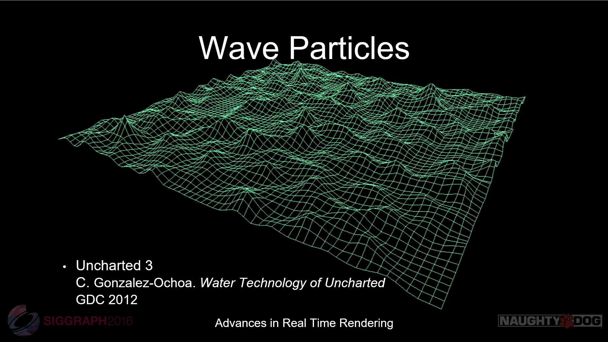

# Real time river editor #

I've always been interested in water in games. I played From Dust a lot when it came out and it fascinated me. More rencetly I was also really impressed with the mud and water system of Spintires MudRunner and Uncharted 4. I was watching the Siggraph 2016 talk "Rendering Rapids in Uncharted 4" and something really caught my attention. There was a small demo of an idea called "Wave Particles", developped by Cem Yuksel and al. I was amazed at the quality that could be achieved by such a simple idea and had to try it for myself:

That was a very fun test and even without any lighting it was obvious that it was possible to build a system around this that was very intuitive and fun to use:

 One thing I tried early on was to combine the idea of wave particles and wave packets that we're presented by Stefan Jeschke during the Siggrapgh of 2017. While it was a cool experiement, using them prevents from using a valualbe optimization that plain wave particles offer so I ended up abandonning this effort ealy on and sticked to using wave particles:

Once I had the lighting and modelling in a descent state, I wanted to tackle generating an interesting vector field which could drive the motion of these waves.

I looked at the distance field approach made populat by the folks that did half-life but it lacked the ability of creating interesting vortices which was a property I was hoping to have. Jos Stam stable fluid was also a good condidate.

But then I found out about LBM solvers. The more I looked into these the more they revealed interesting properties. They seemed straight forward to port to implement on GPU, capture vorticity effects really well they could be used to solve the Shallow Water Equation and some configuration converge to some "relaxed" vector field state.

I first did a naive CPU implementation which I used to debug my original implementation:

then ported it to compute:

I was sold on the benifits of the LBM solver very early. The main drawback is the memory required to run it. The method needs to operate on 9 float components. To make it worst, I'm currently using a ping/pong scheme which means twice the amount of data. For example, if running the simulation on a 2d grid that's 256x128, then it's (256x128pixels) x (9 components) x (16 bits) x (2 for ping/ponging)

The vector field is the used to advect some data. Mostly foam related. At the moment the foam amount and some and 2 sets of texture coordinates are advected. We need two sets of uvs because they continually blend back and forth between an advected foam texture as it stretches because of the advection.

Advecting the wave heights and normal maps didn't prove very successful. An very visble and annoying pusling appeared. The pulsing could be minimized using some perlin noise to add some variation but it was a difficult battle to fight.

Roughly at the same time I was tackling these issues, Stefan Jeschke presented another new idea called wave Profile Buffers during Siggraph 2018. As soon as I saw the presentation I started reading the paper so that I could see if it could be used in the context I'm dealing with. Sampling the wave profiles dones't require uv coordinates; they only need a world position, a time value, and a direction. This means that the wave front generated by sampling these wave profiles aren't spacially and temporally coherant. This is great since it iradicates all pulsing problems the advected wave particles caused.

The lighting of the water is fairly standard. There is a standard specular term for the water surface. For the light scattered in the water volume, I use the analytice solution of two exponential integrals. I light an average point which is the halfway point between the water surface and the river bed directly underneath the surface point. I then light this point with two imaginary infinite planes which acts as large area lights. Finally I evaluate the two exponential integrals and average them. Finally when the sun angle hits a certain grazing angle threshold, I refract a ray to go and fetch a value from the sky luminance and inject this as some extra water scattering that can occur on the wave tips.

Future work:
There is a lot of work left to do for this to be production ready. The next step will be to implement a system which will let me paint large river canals. I have been thinking about using some kind of virtual texture setup where the velocity field could be baked with some initial conditions simulation conditions that could be used to jump start a tile as the camera approaches a certain area. This would mean the cost of running the simulation wouldn't have to be taken at runtime. Also, I'm hoping that wave profile buffers could also be pre-generate in a large texture which would make them much more feasible to use on a tigheter gpu budget. Erosion would also be a very cool feature to add. And (obviously) having some object interact and flow in the water itself. 

