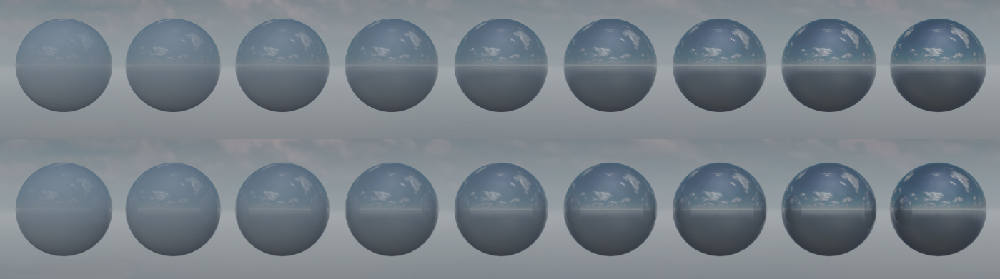
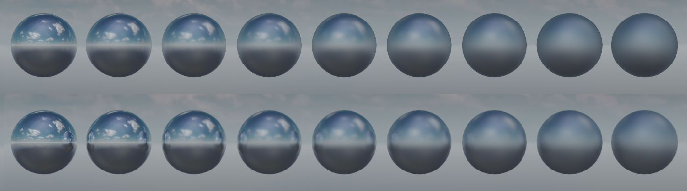
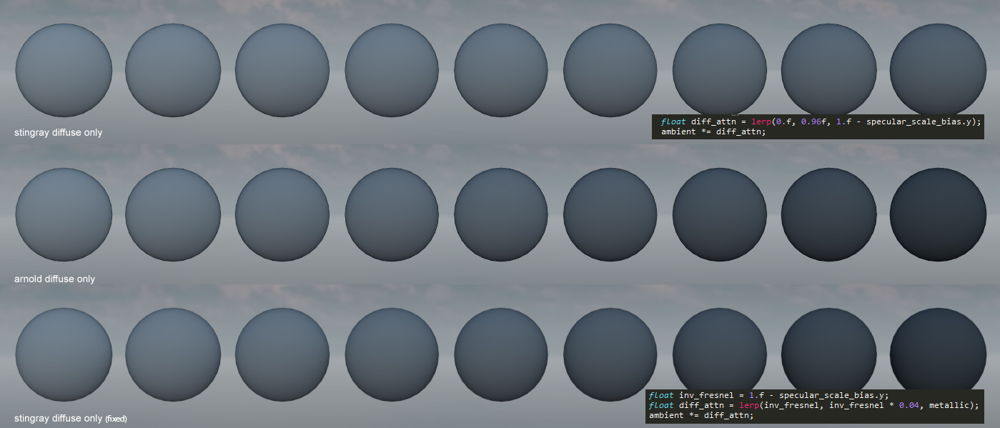
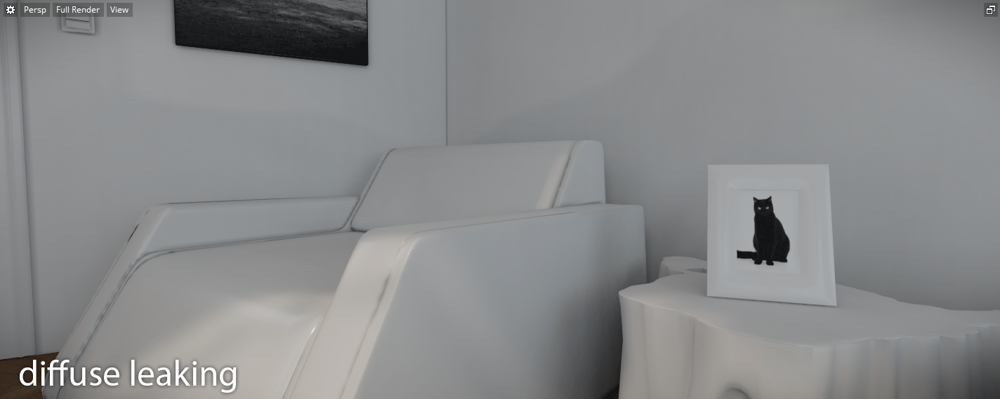
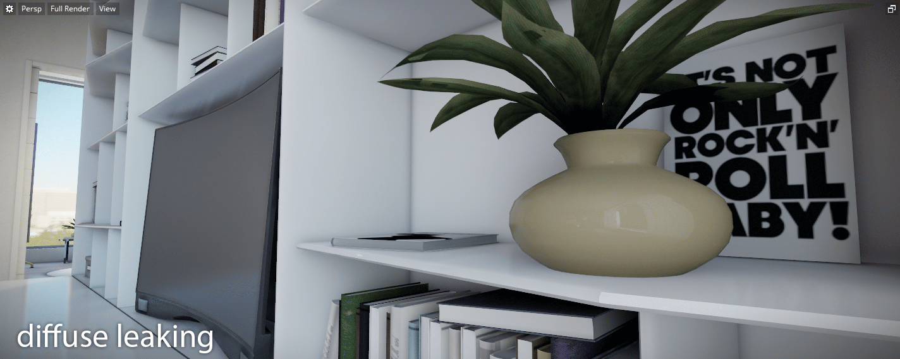
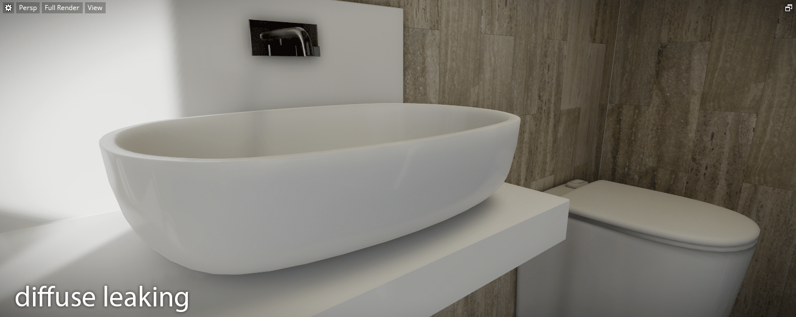
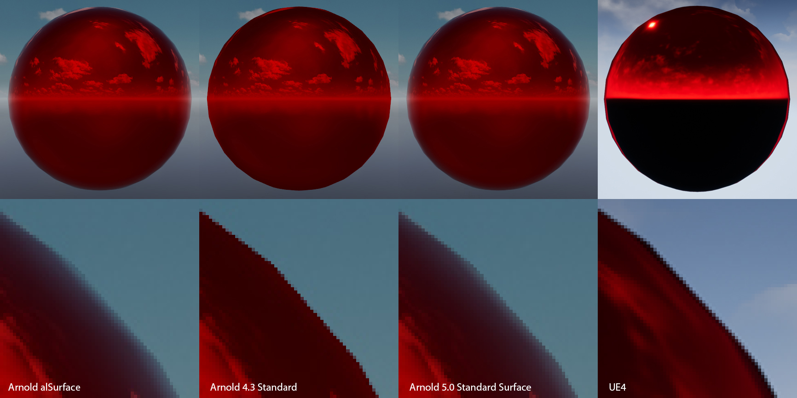
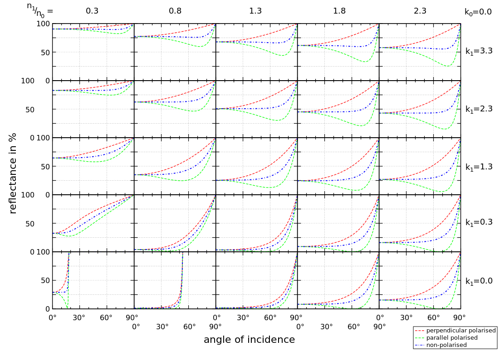

# Validating materials and lights in Stingray #
Stingray 1.9 is just around the corner and with it will come our new physical lights. I wanted to write a little bit about the validation process that we went through to increase our confidence in the behaviour of our standard material and physical lights.

Early on we were quite set on building a small light room similar to what the Fox Engine team presented at GDC in 2013 as a validation process. But while this seemed like a fantastic way to validate the entire pipeline is giving plausible results, it felt like identifying the source of discontinuities when comparing photographs vs renders might involve a lot of guess work. So we decided to delay the validation process through a light room and started thinking about comparing our values with another high quality renderer. Since Arnold joined Autodesk last year and that we had access to a license server it seemed like a very good candidate. Small note on Arnold: the Arnold SDK is extremely easy to use and can be [downloaded](https://www.solidangle.com/arnold/download) for free. If you don't have a license you still have access to all the features and the only limitation is that the rendered frames are watermarked. 

We started writing a Stingray plugin that supported simple scene reflection into Arnold. We also implemented a simple custom Arnold display driver which allowed us to forward the rendered tiles directly into the stingray viewport.

### Material parameters mapping ###
The trickiest part of the reflection was to find an Arnold material which we could use to validate. When we started this work we used Arnold 4.3 and realized early that the Arnold's [Standard shader](https://support.solidangle.com/display/AFMUG/Standard) didn't map very well to the Metallic/Roughness model. We had more luck using the [alSurface shader](http://www.anderslanglands.com/alshaders/alSurface.html) with the following mapping:

~~~~
// "alSurface"
// ==============================================================================================
AiNodeSetRGB(surface_shader, "diffuseColor", color.x, color.y, color.z);
AiNodeSetInt(surface_shader, "specular1FresnelMode", 0);
AiNodeSetInt(surface_shader, "specular1Distribution", 1);
AiNodeSetFlt(surface_shader, "specular1Strength", 1.0f - metallic);
AiNodeSetRGB(surface_shader, "specular1Color", white.x, white.y, white.z);
AiNodeSetFlt(surface_shader, "specular1Roughness", roughness);
AiNodeSetFlt(surface_shader, "specular1Ior", 1.5f); // solving ior = (n-1)^2/(n+1)^2 for 0.04 gives 1.5
AiNodeSetRGB(surface_shader, "specular1Reflectivity", white.x, white.y, white.z);
AiNodeSetRGB(surface_shader, "specular1EdgeTint", white.x, white.y, white.z);

AiNodeSetInt(surface_shader, "specular2FresnelMode", 1);
AiNodeSetInt(surface_shader, "specular2Distribution", 1);
AiNodeSetFlt(surface_shader, "specular2Strength", metallic);
AiNodeSetRGB(surface_shader, "specular2Color", color.x, color.y, color.z);
AiNodeSetFlt(surface_shader, "specular2Roughness", roughness);
AiNodeSetRGB(surface_shader, "specular2Reflectivity", white.x, white.y, white.z);
AiNodeSetRGB(surface_shader, "specular2EdgeTint", white.x, white.y, white.z);
~~~~

Finally we would tonemap the Arnold linear data with our own tonemapper directly in Stingray which minimized the source of potential deltas between our results and Arnolds. With that at hand we could start to compare renders:

Halfway through our validation process Arnold 5.0 got released and with it came the new [Standard Surface shader](https://support.solidangle.com/display/A5AFMUG/Standard+Surface) which is based on a Metalness/Roughness workflow. This allowed for a much simpler mapping:

~~~~
// "standard_surface"
// ==============================================================================================
AiNodeSetFlt(standard_shader, "base", 1.f);
AiNodeSetRGB(standard_shader, "base_color", color.x, color.y, color.z);
AiNodeSetFlt(standard_shader, "diffuse_roughness", 0.f); // Use Lambert for diffuse

AiNodeSetFlt(standard_shader, "specular", 1.f);
AiNodeSetFlt(standard_shader, "specular_IOR", 1.5f); // solving ior = (n-1)^2/(n+1)^2 for 0.04 gives 1.5
AiNodeSetRGB(standard_shader, "specular_color", 1, 1, 1);
AiNodeSetFlt(standard_shader, "specular_roughness", roughness);
AiNodeSetFlt(standard_shader, "metalness", metallic);
~~~~

### Investigating the differences ###

The first thing we noticed is an excess in reflection intensity for reflections with a large incident angles. Arnold supports light path expressions (https://support.solidangle.com/display/A5AFMUG/Introduction+to+Light+Path+Expressions) which made it very easy to identify which term caused the difference between ours and their results. In this particular case we quickly identified that we had an energy conservation issue due to a double contribution of the fresnel and diffuse terms:

With scenes with a lot of smooth reflective surfaces, the impact can be quite noticable:

Another source of differences and confusion came from the tint of the fresnel term for metallic surfaces. Here are the behaviors of a few surface shaders I had looked into (not the tint of the fresnel reflection at the edge):

It wasn't clear to me how Fresnel's law of reflectivity applied to metals. Following a post on Twitter Brooke Hodgman made an elegant statement claiming "Metalic reflections are coloured because their Fresnel is wavelength varying, but Fresnel still goes to 1 at 90deg for every wavelength". I later found a [graph](https://en.wikipedia.org/wiki/Reflectance) which confirmed exactly that: 

Since our real time solution relies on a pre filtered fresnell offset stored in a lut we get results that are slightly different from Arnold's standard_surface (see "the effect of metalness" from Zap Andeson's [Physical Material Whitepaper](https://www.dropbox.com/s/jt8dk65u14n2mi5/Physical%20Material%20-%20Whitepaper%20-%201.01.pdf?dl=0))

With the brdf validated we could start looking into validating our Physical Lights. We currently support point lights, spotlights and directional lights (with more to come). The main problem that we discovered here is that the fall off equation we use is a bit awkward. We use 1/(d+1)^2 as opposed to 1/d^2. The main reason behind this decision is to manage the overflow that could occur in the light accumulation buffer (note how the intensity values can't shoot to infinity as distance approaches zero). Unfortunatly this decision also means we can't get physically correct light falloffs in a scene. This is something we are considering revisiting. Using something like 2/(d+e)^2 where e is 1/max_value along with ev shifts up and down while writting and reading from the accumulation buffer (as described by Nathan Reed http://www.reedbeta.com/blog/artist-friendly-hdr-with-exposure-values/) could be a good step forward.

Finally we were also able to validate our ies lights and color temperature:

Integrating an high quality offline renderer like Arnold has proven invaluable in the process of validating our lights in Stingray. There are many other features where this could be helpfull:

I also think that it could be a very good tools for content creators to build up intuition on the impact of indirect lighting. For example in a simple scene like this, adding a diffuse plane dramatically changes the lighting on the Budha statue:

The next step is now to compare our results with photographs gathered from a controlled environments. To be continued...