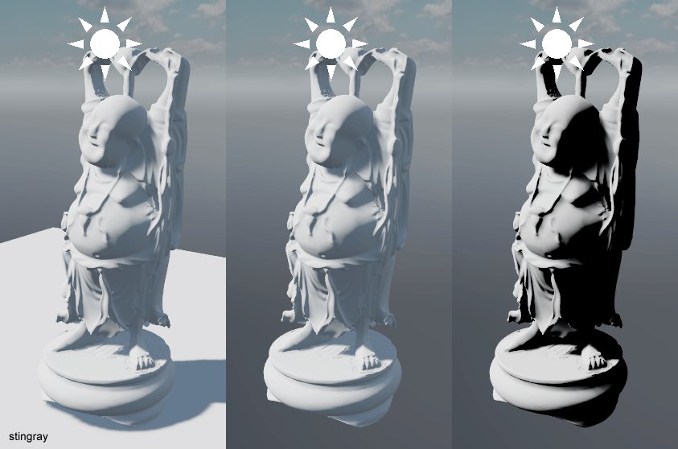

# Validating materials and lights in Stingray #

Stingray 1.9 is just around the corner and with it will come our new physical lights. I wanted to write a little bit about the validation process that we went through to increase our confidence in the behaviour of our materials and lights.

Early on we were quite set on building a small controlled "light room" similar to what the [Fox Engine team presented at GDC](https://youtu.be/FQMbxzTUuSg?t=19m25s) as a validation process. But while this seemed like a fantastic way to confirm the entire pipeline is giving plausible results, it felt like identifying the source of discontinuities when comparing photographs vs renders might involve a lot of guess work. So we decided to delay the validation process through a controlled light room and started thinking about comparing our results with a high quality offline renderer. Since [SolidAngle](https://www.solidangle.com/) joined Autodesk last year and that we had access to an [Arnold](https://www.solidangle.com/arnold/) license server it seemed like a good candidate. Note that the Arnold SDK is extremely easy to use and can be [downloaded](https://www.solidangle.com/arnold/download) for free. If you don't have a license you still have access to all the features and the only limitation is that the rendered frames are watermarked. 

We started writing a Stingray plugin that supported simple scene reflection into Arnold. We also implemented a custom Arnold Output Driver which allowed us to forward Arnold's linear data directly into the Stingray viewport where they would be gamma corrected and tonemapped by Stingray (minimizing as many potential sources of error).

### Material parameters mapping ###
The trickiest part of the process was to find an Arnold material which we could use to validate. When we started this work we used Arnold 4.3 and realized early that the Arnold's [Standard shader](https://support.solidangle.com/display/AFMUG/Standard) didn't map very well to the Metallic/Roughness model. We had more luck using the [alSurface shader](http://www.anderslanglands.com/alshaders/alSurface.html) with the following mapping:

~~~~
// "alSurface"
// ==============================================================================================
AiNodeSetRGB(surface_shader, "diffuseColor", color.x, color.y, color.z);
AiNodeSetInt(surface_shader, "specular1FresnelMode", 0);
AiNodeSetInt(surface_shader, "specular1Distribution", 1);
AiNodeSetFlt(surface_shader, "specular1Strength", 1.0f - metallic);
AiNodeSetRGB(surface_shader, "specular1Color", white.x, white.y, white.z);
AiNodeSetFlt(surface_shader, "specular1Roughness", roughness);
AiNodeSetFlt(surface_shader, "specular1Ior", 1.5f); // solving ior = (n-1)^2/(n+1)^2 for 0.04 gives 1.5
AiNodeSetRGB(surface_shader, "specular1Reflectivity", white.x, white.y, white.z);
AiNodeSetRGB(surface_shader, "specular1EdgeTint", white.x, white.y, white.z);

AiNodeSetInt(surface_shader, "specular2FresnelMode", 1);
AiNodeSetInt(surface_shader, "specular2Distribution", 1);
AiNodeSetFlt(surface_shader, "specular2Strength", metallic);
AiNodeSetRGB(surface_shader, "specular2Color", color.x, color.y, color.z);
AiNodeSetFlt(surface_shader, "specular2Roughness", roughness);
AiNodeSetRGB(surface_shader, "specular2Reflectivity", white.x, white.y, white.z);
AiNodeSetRGB(surface_shader, "specular2EdgeTint", white.x, white.y, white.z);
~~~~

Stingray VS Arnold: roughness = 0, metallicness = [0, 1]

Stingray VS Arnold: metallicness = 1, roughness = [0, 1]

Halfway through the validation process Arnold 5.0 got released and with it came the new [Standard Surface shader](https://support.solidangle.com/display/A5AFMUG/Standard+Surface) which is based on a Metalness/Roughness workflow. This allowed for a much simpler mapping:

~~~~
// "aiStandardSurface"
// ==============================================================================================
AiNodeSetFlt(standard_shader, "base", 1.f);
AiNodeSetRGB(standard_shader, "base_color", color.x, color.y, color.z);
AiNodeSetFlt(standard_shader, "diffuse_roughness", 0.f); // Use Lambert for diffuse

AiNodeSetFlt(standard_shader, "specular", 1.f);
AiNodeSetFlt(standard_shader, "specular_IOR", 1.5f); // solving ior = (n-1)^2/(n+1)^2 for 0.04 gives 1.5
AiNodeSetRGB(standard_shader, "specular_color", 1, 1, 1);
AiNodeSetFlt(standard_shader, "specular_roughness", roughness);
AiNodeSetFlt(standard_shader, "metalness", metallic);
~~~~

### Investigating material differences ###

The first thing we noticed is an excess in reflection intensity for reflections with large incident angles. Arnold supports [Light Path Expressions](https://support.solidangle.com/display/A5AFMUG/Introduction+to+Light+Path+Expressions) which made it very easy to compare and identify the term causing the differences. In this particular case we quickly identified that we had an energy conservation problem. Specifically the contribution from the Fresnel reflections was not removed from the diffuse contribution:

Scenes with a lot of smooth reflective surfaces demonstrates the impact of this issue noticeably:

Another source of differences and confusion came from the tint of the Fresnel term for metallic surfaces. Different shaders I investigaed had different behaviors. Some tinted the Fresnel term with the base color while some others didn't:

It wasn't clear to me how Fresnel's law of reflection applied to metals. I asked on Twitter what peoples thoughts were on this and got this simple and elegant [claim](https://twitter.com/BrookeHodgman/status/884532159331028992) made by Brooke Hodgman: *"Metalic reflections are coloured because their Fresnel is wavelength varying, but Fresnel still goes to 1 at 90deg for every wavelength"*. This convinced me instantly that indeed the correct thing to do was to use an un-tinted Fresnel contribution regardless of the metallicness of the material. I later found this [graph](https://en.wikipedia.org/wiki/Reflectance) which also confirmed this: 

For the Fresnel term we use a pre filtered Fresnel offset stored in a 2d lut (as proposed by Brian Karis in [Real Shading in Unreal Engine 4](http://blog.selfshadow.com/publications/s2013-shading-course/karis/s2013_pbs_epic_slides.pdf)). While results can diverge slightly from Arnold's Standard Surface Shader (see "the effect of metalness" from Zap Andeson's [Physical Material Whitepaper](https://www.dropbox.com/s/jt8dk65u14n2mi5/Physical%20Material%20-%20Whitepaper%20-%201.01.pdf?dl=0)), in most cases we get an edge tint that is pretty close:

### Investigating light differences ###

With the brdf validated we could start looking into validating our physical lights. Stingray currently supports point, spot, and directional lights (with more to come). The main problem we discovered with our lights is that the attenuation function we use is a bit awkward. Specifically we attenuate by I/(d+1)^2 as opposed to I/d^2 (Where 'I' is the intensity of the light source and 'd' is the distance to the light source from the shaded point). The main reason behind this decision is to manage the overflow that could occur in the light accumulation buffer. Adding the +1 effectively clamps the maximum value intensity of the light as the intensity set for that light itself i.e. as 'd' approaches zero 'I' approaches the intensity set for that light (as opposed to infinity). Unfortunatly this decision also means we can't get physically [correct light falloffs](https://www.desmos.com/calculator/jydb51epow) in a scene:

Even if we scale the intensity of the light to match the intensity for a certain distance (say 1m) we still have a different falloff curve than the physically correct attenuation. It's not too bad in a game context, but in the architectural world this is a bigger issue:

This issue will be fixed in Stingray 1.10. Using I/(d+e)^2 (where 'e' is 1/max_value along) with an EV shift up and down while writting and reading from the accumulation buffer as described by [Nathan Reed](http://www.reedbeta.com/blog/artist-friendly-hdr-with-exposure-values/) is a good step forward.

Finally we were also able to validate our ies profile parser/shader and our color temperatures behaved as expected:

### Results and final thoughts ###

Integrating a high quality offline renderer like Arnold has proven invaluable in the process of validating our lights in Stingray. A similar validation process could be applicable to many other aspects of our rendering pipeline (antialiasing, refractive materials, fur, hair, post-effects, volumetrics, ect)

I also think that it can be a very powerful tool for content creators to build intuition on the impact of indirect lighting in a particular scene. For example in a simple level like this, adding a diffuse plane dramatically changes the lighting on the Buddha statue:

The next step is now to compare our results with photographs gathered from a controlled environments. To be continued...